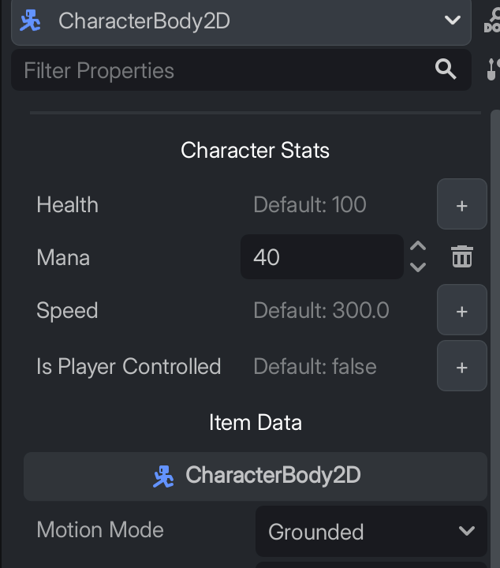

# Metadata Manager for Godot 4

A simple but powerful plugin for Godot 4 to streamline the management of node metadata. It allows you to pre-define metadata templates and then quickly add, edit, or remove them on any node through a dedicated UI in the Inspector.

 
<center> </center>


## The Problem It Solves

In Godot, metadata is a fantastic way to attach custom properties to nodes without the overhead of creating a dedicated script. This is perfect for simple data, like adding a `focus_sound_override` path to a `Button`.

However, the built-in process for adding metadata can be cumbersome. For each piece of metadata, you must manually:
1.  Click "Add Metadata".
2.  Type the key (the name).
3.  Select the value data type from a long dropdown list.
4.  Enter the value.

Repeating this process for dozens of nodes is tedious and error-prone. This plugin was created (with the assistance of Gemini) to solve exactly that problem.

## Features

*   **Template-Based Workflow**: Define all your common metadata schemas in a single, centralized GDScript file.
*   **Intuitive UI**: A dedicated, foldable section appears in the Inspector for any node matching a template.
*   **Full CRUD Support**: Quickly **Add**, **Edit**, or **Delete** metadata directly from the Inspector.
*   **Type-Safe Editors**: The plugin automatically provides the correct editor (`SpinBox`, `CheckBox`, `LineEdit`) for each data type.
*   **Full Undo/Redo Integration**: Every action (add, remove, change) is properly registered with Godot's Undo/Redo system and works with `Ctrl+Z`/`Ctrl+Y`.
*   **First-Time User Friendly**: Automatically generates a well-commented example template file on first activation.

## How to Use

### 1. Installation & Activation

1.  Download this repository and place the `addons/metadata_manager` folder inside your Godot project's `addons` directory.
2.  Open your Godot project.
3.  Go to **Project -> Project Settings -> Addons**.
4.  Find "Metadata Manager" in the list and change its status from "Disabled" to **"Enabled"**.

### 2. The Template File

Upon first activation, the plugin will automatically create a file named `metadata_definitions.gd` in the root of your project (`res://`).

This file is the heart of the plugin. Open it to see a fully commented example of how to define your metadata templates.

Here is a quick overview of its structure:

```gdscript
# res://metadata_definitions.gd
@tool
extends RefCounted

func get_all_templates() -> Dictionary:
    return {
        # Each key is a template name, which becomes a foldable header.
        "Character Stats": {
            # "applicable_types" is an array of node types this template applies to.
            "applicable_types": [&"CharacterBody2D", &"CharacterBody3D"],
            # "definitions" is an array of metadata properties.
            "definitions": [
                { "name": "health", "type": TYPE_INT, "default_value": 100 },
                { "name": "speed", "type": TYPE_FLOAT, "default_value": 300.0 },
            ]
        },
        "UI Sounds": {
            "applicable_types": [&"Button", &"CheckBox"], 
            "definitions": [
                { "name": "click_sound_override", "type": TYPE_STRING, "default_value": "" },
                { "name": "focus_sound_override", "type": TYPE_STRING, "default_value": "" },
            ]
        },
    }
```

You can customize this file to fit your project's needs. The path to this file can be changed in **Project -> Project Settings -> Addons -> Metadata Manager**.

### 3. Using the Manager

1.  Select any node in your scene (e.g., a `Button`).
2.  If the node's type matches one of the `applicable_types` in your template file, a new foldable section will appear at the top of the Inspector.
3.  From here, you can:
    *   Click the **`+`** button to add a piece of metadata with its default value.
    *   Edit the value of existing metadata using the provided controls.
    *   Click the **trash can icon** to remove a piece of metadata.

All actions are fully integrated with the editor's undo/redo history.

## Current Status

### What Works

*   **Simple Data Types**: `Int`, `Float`, `String`, and `Bool` are fully supported with dedicated editors.
*   **Undo/Redo**: All operations are robust and work with standard editor shortcuts.
*   **Inheritance**: Templates correctly apply to child node types (e.g., a template for `Node2D` will also appear on `Sprite2D`).

### What Doesn't Work (Yet)

*   **Complex Types**: `Dictionary`, `Array`, and other complex resource types are not yet supported. The UI for these requires a more sophisticated implementation (e.g., a pop-up editor).

**Contributions are very welcome!** If you'd like to help implement support for more complex types, please feel free to open a pull request.

## Disclaimer

This plugin was developed primarily with the assistance of the AI model Gemini 2.5 pro and is intended mainly for personal use. While it has been tested and verified to work as described, it is provided "as-is" without any warranty. Please use it at your own discretion and always back up your project.
